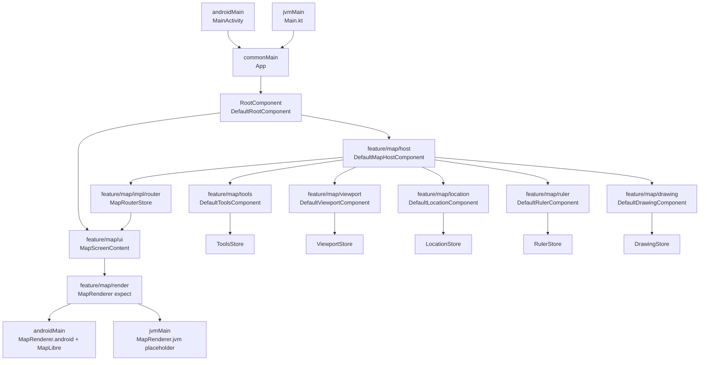

# DemoMapApp

Kotlin Multiplatform application with shared Compose UI, Decompose navigation, MVIKotlin stores, and Android-only MapLibre rendering.

## Current Repository Shape

- The repository currently has one Gradle application module: `:composeApp`.
- The code is split by source set, not by Gradle feature modules:
  - `composeApp/src/commonMain/kotlin`: shared UI, components, stores, reducers, executors, map domain models.
  - `composeApp/src/androidMain/kotlin`: Android entrypoint, MapLibre renderer, Android location integration.
  - `composeApp/src/jvmMain/kotlin`: desktop entrypoint and a stub map renderer.
- The main business area implemented today is `feature/map`.

## Architecture Notes

- Navigation root: `MainActivity` and `Main.kt` create `RootComponent`, which mounts a single `MapScreen`.
- UI flow: `App` -> `RootContent` -> `MapScreenContent`.
- Screen orchestration: `DefaultMapHostComponent` is the parent Decompose component for the map screen.
- State management: child features use MVIKotlin stores with the usual split of `Store` + `Executor` + `Reducer`.
- Cross-feature aggregation: `MapRouterStore` merges child states into one `MapScreenComponent.Model` and coordinates overlay interactions.
- Platform boundary: rendering is abstracted as `expect/actual` `MapRenderer`; Android uses MapLibre, JVM shows a placeholder.

## Dependency Scheme



## What This Means In Practice

- The project is KMP-first at source set level, but not yet modular at Gradle module level.
- `feature/map` is already internally segmented by responsibility (`api`, `host`, `tools`, `viewport`, `location`, `ruler`, `drawing`, `render`).
- `DefaultMapHostComponent` is still the main composition root for the screen and remains the tightest coupling point between child features.
- `MapRouterStore` is the central state aggregator for screen-level behavior.

## Mismatch To Keep In Mind

- Repository docs describe a more modular target architecture, but the current source of truth is a single-module `:composeApp` setup.
- Any architectural discussion should distinguish between:
  - current implemented structure
  - target modular structure described in process docs

## Build and Run Android

- macOS/Linux

```shell
./gradlew :composeApp:assembleDebug
```

- Windows

```shell
.\gradlew.bat :composeApp:assembleDebug
```

## Build and Run Desktop

- macOS/Linux

```shell
./gradlew :composeApp:run
```

- Windows

```shell
.\gradlew.bat :composeApp:run
```
